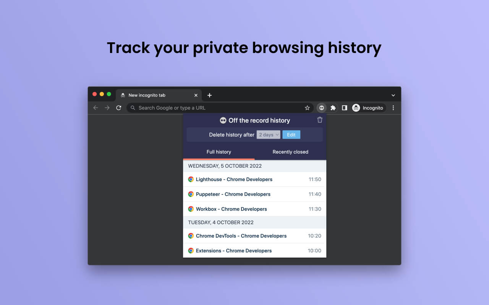
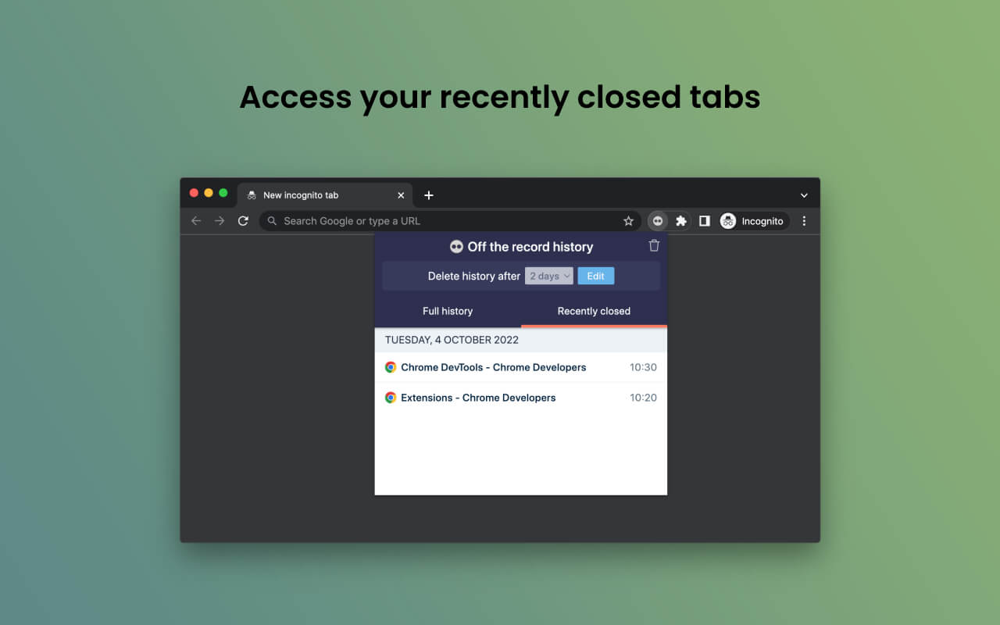
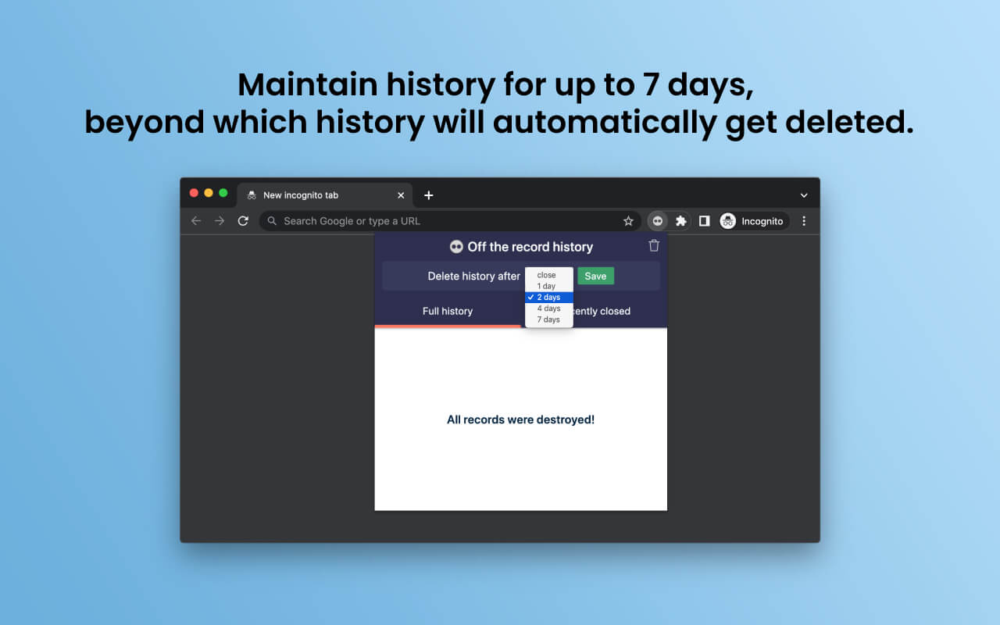

#  Off The Record History

Browser extension to track your private browsing history in incognito mode. Maintain incognito browsing history for up to 7 days.

### 🎁 Build you next extension with new [Chrome Extension CLI](https://github.com/dutiyesh/chrome-extension-cli) 🚀

## Install Extension

 
Chrome Web Store link: https://chrome.google.com/webstore/detail/off-the-record-history/djbaolpiihkcmmfjnjdmomeeheldhhdp  

## Installation Guide

[Read this guide](GUIDE.md) for installation or you can watch [this video on YouTube](https://www.youtube.com/watch?v=jYN7w_kNE-w).

## Features

### Track your private browsing history

### Access your recently closed tabs

### Maintain incognito browsing history for up to 7 days, beyond which history will automatically get deleted

## Support

